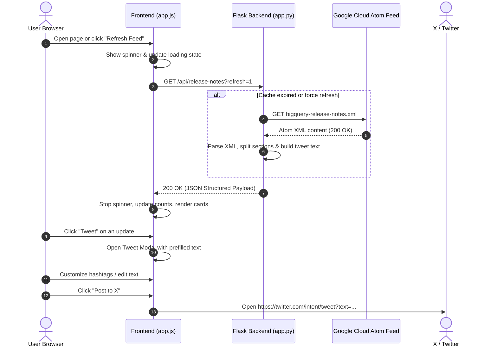

# BigQuery Release Notes & Social Tracker ⚡

[](https://www.python.org/)
[](https://flask.palletsprojects.com/)
[](https://github.com/astral-sh/uv)
[](LICENSE)

A modern, responsive web application built with **Python Flask** and **plain vanilla HTML5, CSS3, and JavaScript**. It connects directly to the [official Google Cloud BigQuery Atom Feed](https://docs.cloud.google.com/feeds/bigquery-release-notes.xml), parses release notes into categorized update items (`Feature`, `Change`, `Deprecated`, `Announcement`, `Security`, `Issue`), and provides an interactive interface with live refreshing and 1-click **Tweet / X publishing**.

---

## 📑 Table of Contents

- [Key Features](#-key-features)
- [Architecture & Data Flow](#-architecture--data-flow)
- [Server vs Client Breakdown](#-server-vs-client-breakdown)
- [Project Structure](#-project-structure)
- [Getting Started](#-getting-started)
  - [Prerequisites](#prerequisites)
  - [Installation & Environment Setup](#installation--environment-setup)
  - [Running the Application](#running-the-application)
- [API Reference](#-api-reference)
- [Social Sharing Flow](#-social-sharing-flow)
- [License](#-license)

---

## 🌟 Key Features

1. **Live XML/Atom Feed Ingestion**:
   - Fetches and parses `https://docs.cloud.google.com/feeds/bigquery-release-notes.xml` in real time.
   - Granularly breaks down release dates into distinct, individually actionable update cards.
   - Sanitizes HTML links, resolving relative cloud URLs and enforcing safe external tabs (`rel="noopener noreferrer"`).

2. **Interactive Refresh with Spinner**:
   - Dedicated **Refresh Feed** button with an animated CSS spinner.
   - Cache management: In-memory TTL caching (5 minutes) with forced cache-busting when the refresh button is clicked.

3. **Tweet / Share on X Integration**:
   - **1-Click Tweet Composer**: Opens a pre-formatted tweet modal with category emojis, summary snippet, link, and relevant hashtags.
   - **Live 280-Character Counter**: Real-time counter with visual threshold alerts (green `< 250`, amber `250–280`, red `> 280`).
   - **Quick Hashtag Toggles**: Add/remove `#BigQuery`, `#GoogleCloud`, `#DataEngineering`, `#SQL`, and `#GenAI` with a single click.
   - **Multi-Select Batch Digest**: Check multiple updates to generate a consolidated thread/digest.
   - **Twitter Web Intent**: Direct browser-level publishing to X (`https://twitter.com/intent/tweet`) without needing Twitter API keys or OAuth setups.

4. **Instant Search & Category Filtering**:
   - Client-side keyword search across dates, categories, and content (shortcut: `/` to focus).
   - Category pill filters (`Features`, `Changes`, `Deprecated`, `Announcements`, `Security`, `Issues`) with dynamic item counters.

5. **Clean Vanilla UI (Light & Dark Theme)**:
   - Built purely with Vanilla HTML, CSS, and ES6 JavaScript — zero heavy frontend frameworks (no React, no Vue, no jQuery).
   - Theme toggle with automatic local storage persistence.

---

## 🏗️ Architecture & Data Flow



---

## 🔍 Server vs Client Breakdown

### 1. Server-Side (`app.py`)
- **Feed Retriever**: `fetch_release_notes(force_refresh)` requests the Google Cloud XML feed using `requests` with custom headers and error handling.
- **Parser & Transformer**: `parse_feed_entries()` uses `feedparser` and `BeautifulSoup4` to split multi-topic date entries into discrete update cards.
- **Tweet Formatter**: `generate_tweet_text()` creates formatted social copy within character limits.
- **Link Normalizer**: `clean_html_content()` ensures all relative paths point to `https://cloud.google.com`.

### 2. Client-Side (`index.html`, `style.css`, `app.js`)
- **State Management**: Encapsulated in the `ReleaseNotesApp` class to track entries, active filters, search queries, and selected cards.
- **Responsive Theme Engine**: Custom CSS properties (`var(--bg-primary)`, `var(--text-primary)`) for seamless Light/Dark mode switching.
- **Toast Notifications**: Built-in visual notifications for copy-to-clipboard and refresh actions.

---

## 📁 Project Structure

```
ioannis-event-talks-app/
├── app.py                     # Flask server with feed parser and REST API
├── requirements.txt           # Python package dependencies
├── .gitignore                 # Excluded environments and temporary files
├── README.md                  # Project documentation
├── templates/
│   └── index.html             # Vanilla HTML5 layout shell
└── static/
    ├── css/
    │   └── style.css          # Vanilla CSS: Themes, animations, cards & modal
    └── js/
        └── app.js             # Vanilla JS: State, filtering, modal & Twitter intent
```

---

## 🚀 Getting Started

### Prerequisites
- **Python 3.10+**
- **[uv](https://docs.astral.sh/uv/)** (recommended fast Python package manager)
- **[gh](https://cli.github.com/)** (optional, for GitHub CLI operations)

### Installation & Environment Setup

1. **Clone the repository**:
   ```bash
   git clone https://github.com/ioannis-develekos/ioannis-event-talks-app.git
   cd ioannis-event-talks-app
   ```

2. **Create a virtual environment with `uv`**:
   ```bash
   uv venv
   ```

3. **Install dependencies**:
   ```bash
   uv pip install -r requirements.txt
   ```

### Running the Application

Start the Flask development server:
```bash
uv run python app.py
```

Open your browser and navigate to:
👉 **`http://localhost:5000`**

---

## 🔌 API Reference

### `GET /api/release-notes`
Fetches all structured release notes.

#### Query Parameters:
| Parameter | Type | Default | Description |
| :--- | :--- | :--- | :--- |
| `refresh` | `string` | `false` | Pass `1`, `true`, or `yes` to force a live fetch from Google Cloud. |

#### Sample Response:
```json
{
  "status": "success",
  "data": {
    "fetched_at": "2026-08-26 10:15:00 UTC",
    "from_cache": false,
    "total_entries": 30,
    "total_updates": 60,
    "feed_info": {
      "title": "BigQuery - Release notes",
      "link": "https://cloud.google.com/bigquery/docs/release-notes"
    },
    "entries": [
      {
        "id": "tag:google.com,2016:bigquery-release-notes#August_25_2026",
        "date": "August 25, 2026",
        "link": "https://docs.cloud.google.com/bigquery/docs/release-notes#August_25_2026",
        "item_count": 1,
        "items": [
          {
            "id": "August_25_2026-item-0",
            "category": "Feature",
            "text": "BigQuery data governance tags are supported in Terraform. This feature is in Preview.",
            "html": "<p>BigQuery data governance tags are supported in Terraform...</p>",
            "tweet_text": "🚀 #BigQuery update (August 25, 2026) [Feature]: BigQuery data governance tags are supported in Terraform. This feature is in Preview.\n\n🔗 https://docs.cloud.google.com/bigquery/docs/release-notes#August_25_2026\n\n#GoogleCloud #DataEngineering #Cloud"
          }
        ]
      }
    ]
  }
}
```

### `GET /health`
Returns service health status:
```json
{
  "status": "ok",
  "service": "BigQuery Release Notes Viewer"
}
```

---

## 🐦 Social Sharing Flow

1. Click the **Tweet** button on any release card.
2. The custom **Tweet Composer** opens with the formatted message, link, and character count.
3. Toggle hashtags or edit your text as desired.
4. Click **Post to X (Twitter)** to launch Twitter's official Web Intent composer in a popup.

---

## 📄 License

This project is licensed under the [MIT License](LICENSE).
